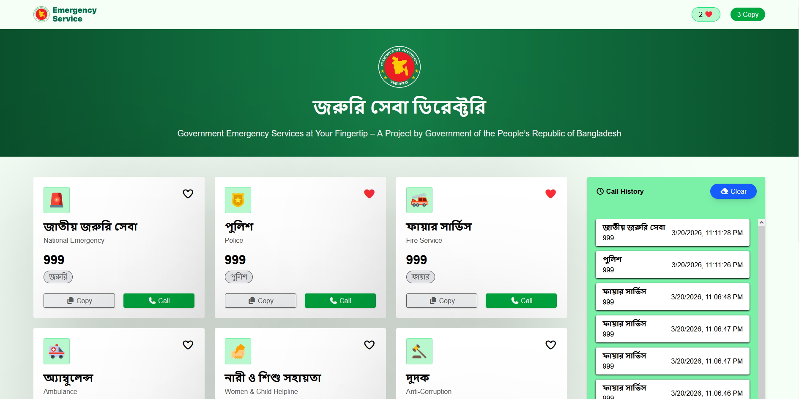
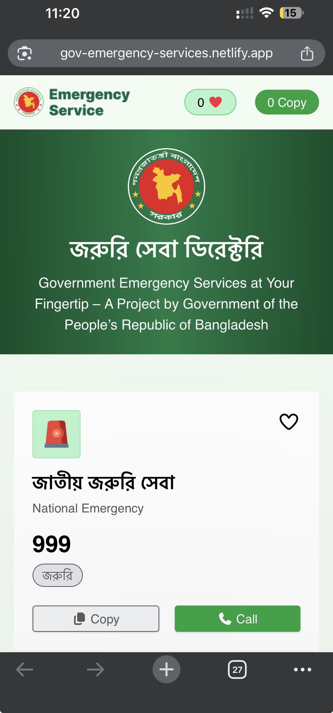

# 📞 Emergency Service Directory - Bangladesh

A modern, responsive web application designed to provide quick access to essential emergency service numbers in Bangladesh. Users can easily find, copy, and dial emergency contacts directly from the dashboard.

## 🌐 Live Link

🔗 https://gov-emergency-services.netlify.app/

## ✨ Features

- **Emergency Contact Cards:** Dedicated cards for each service with icons, names, and numbers.
- **Dynamic Call History:** Automatically logs "Call" button clicks into a dedicated history panel with real-time timestamps.
- **Sticky & Scrollable Sidebar:** The history panel stays fixed while scrolling through cards and becomes scrollable when the list grows.
- **Clipboard Integration:** One-click number copying with an active copy counter.
- **Interaction Feedback:** Ability to "Favourite" emergency cards.
- **Fully Responsive:** Optimized for a seamless experience on Mobile, Tablet, and Desktop.

## 🛠️ Tech Stack

- **Frontend:** React.js
- **Styling:** Tailwind CSS
- **Icons:** FontAwesome
- **State Management:** React Hooks (`useState`)

## 📸 Preview

| Desktop View | Mobile View |
| :--- | :--- |
|  |  |


## 🚀 Getting Started

To run this project locally, follow these steps:

1. **Clone the repository:**
   ```bash
   git clone https://github.com/salmansahed/Emergency-Services.git
   ```
2.  **Navigate to the Directory:**
    ```bash
    cd Emergency-Services
    ```
3.  **Install Dependencies:**
    ```bash
    npm install
    ```
4.  **Start Development Server:**
    ```bash
    npm run dev
    ```
5.  **Open in Browser:** Visit `http://localhost:3000`

---

### 🤝 Contributing
Contributions, issues, and feature requests are welcome! Feel free to check the issues page.

---

**Designed and Developed by [Salman Sahed](https://github.com/salmansahed)**
